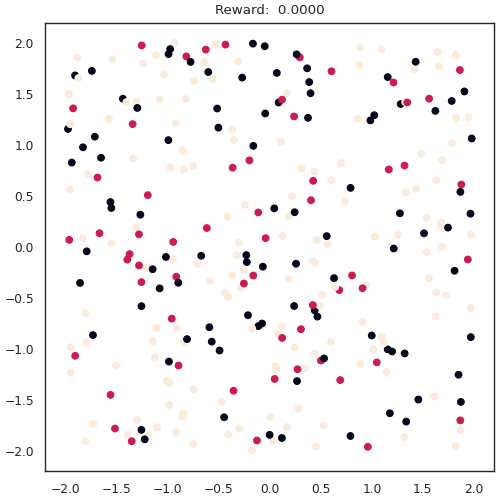
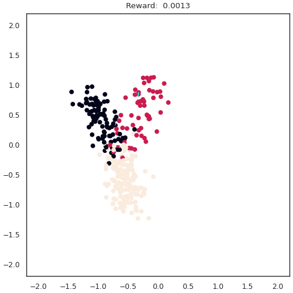

# Independent Node Exploration and Proximal Trajectory

This repository is an implementation of proximal policy optimization (PPO) in a multi-agent environment, specifically targeting multimodal alignment of single-cell data.  The methodology is based off of OpenAI's multi-agent reinforcement learning (RL) [paper](https://arxiv.org/abs/1909.07528) implementing hide-and-seek, adapted to biological and similar information.  The codebase itself is quite flexible, and can be extended to environments in other domains.

## Examples

