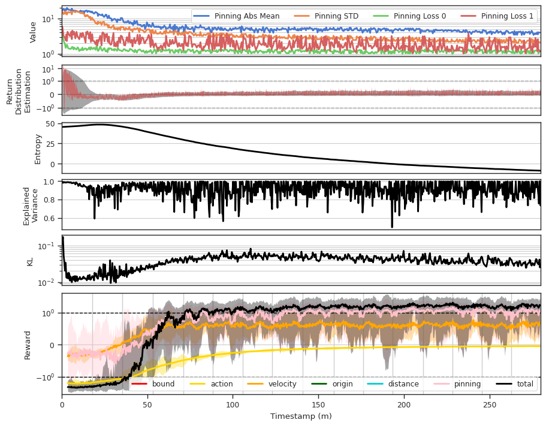
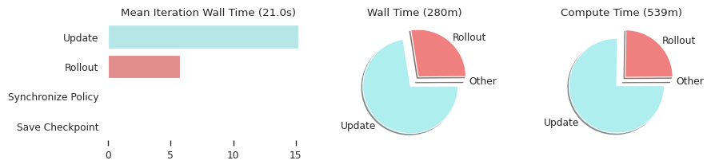
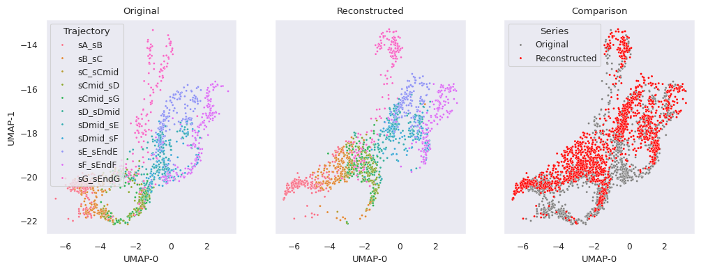
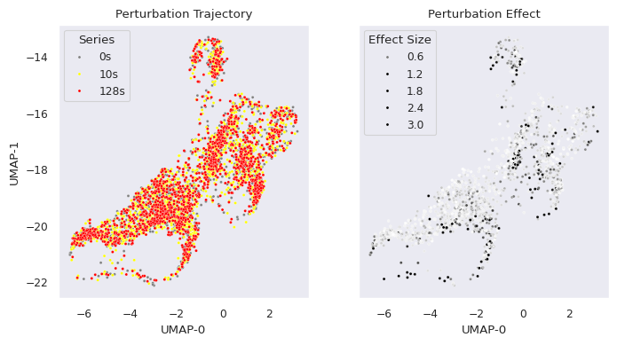
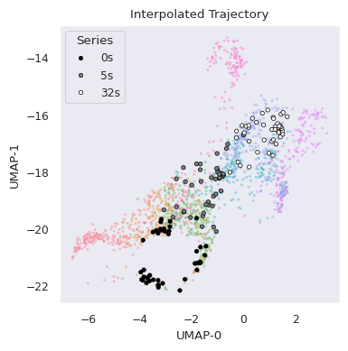

# Inferring virtual cell environments using multi-agent reinforcement learning

Single cells interact continuously to form a cell environment that drives key biological processes. Cells and cell environments are highly dynamic across time and space, fundamentally governed by molecular mechanisms, such as gene expression. Recent sequencing techniques measure single-cell-level gene expression under specific conditions, either temporally or spatially. Using these datasets, emerging works, such as virtual cells, can learn biologically useful representations of individual cells. However, these representations are typically static and overlook the underlying cell environment and its dynamics. To address this, we developed CellTRIP, a multi-agent reinforcement learning method that infers a virtual cell environment to simulate the cell dynamics and interactions underlying given single-cell data. Specifically, cells are modeled as individual agents with dynamic interactions, which can be learned through self-attention mechanisms via reinforcement learning. CellTRIP also applies novel truncated reward bootstrapping and adaptive input rescaling to stabilize training. We can in-silico manipulate any combination of cells and genes in our learned virtual cell environment, predict spatial and/or temporal cell changes, and prioritize corresponding genes at the single-cell level. We applied and benchmarked CellTRIP on various simulated and real gene expression datasets, including recapitulating cellular dynamic processes simulated by gene regulatory networks and stochastic models, imputing spatial organization of mouse cortical cells, predicting developmental gene expression changes after drug treatment in cancer cells, and spatiotemporal reconstruction of Drosophila embryonic development, demonstrating its outperformance and broad applicability. Interactive manipulation of those virtual cell environments, including in-silico perturbation, can prioritize spatial and developmental genes for single-cell-level changes, enabling the generation of new insights into cell dynamics over time and space.

# Why use CellTRIP?

CellTRIP confers several unique advantages over comparable methods:
- Take any number or type of modalities as input,
- Variable cell input quantity,
- Interactive environment,
- Generalizability.

<!-- | Application | Preview | Description | Performance |
| --- | --- | --- | --- |
| Multimodal integration |  | Policy trained on 300 simulated single-cells with multimodal input applied to an integration environment |  |
| Cross-modal imputation |  | Imputation of spatial data from gene expression, simulated until convergence using a CellTRIP trained model |  |
| Development simulation |  | Cell differentiation simulation on single-cell brain data, with CellTRIP agents controlling cell movement in the previously unseed environment |  |
| Trajectory recovery, inference, and prediction |  | Trajectory estimation on single-cell multimodal human brain data across several age groups |  |
| Perturbation analysis |  | Estimated effect size calculation of randomly selected genes from a CellTRIP imputation model on spatial data |  | -->


# Installation instructions (~5-10 minutes)

We have tested training and analysis on Ubuntu 24.04, Ubuntu 16.04 LTS, and `rayproject/ray:2.43.0-py310-gpu`. To install CellTRIP, first clone and navigate to the repository,

```bash
git clone https://github.com/Oafish1/CellTRIP
cd CellTRIP

# CellTRIP may also be installed directly from GitHub without cloning, but does not have version controlled dependencies, and is therefore not recommended
# pip install celltrip@git+https://git@github.com/Oafish1/CellTRIP
```

Create and activate a `conda` virtual environment using Python 3.10,

```bash
conda create -n celltrip python=3.10
conda activate celltrip
```

Install dependencies using `pip`

```bash
# Development install (Recommended)
# For full development capabilities, also install ffmpeg, poppler-utils, boto3, cupy, docker, and poppler-utils
pip install -r requirements.txt
pip install -e .

# Base install
# pip install -e .
```


# Training the model

It is required to start a Ray cluster to train the CellTRIP model. For our applications, we set up a scalable AWS cluster using the [Ray Cluster Launcher](https://docs.ray.io/en/latest/cluster/vms/user-guides/launching-clusters/aws.html). CellTRIP can also be trained locally using the included training script,

```bash
python scripts/train.py \
# Where common arguments include
    <S3_OR_LOCAL_ADATA_1> <S3_OR_LOCAL_ADATA_2>...  # Adata files for training
    
    # Preprocessing
    --sample_counts 10_000 0  # Sample-wise count normalization per modality
    --log_modalities 0  # Modalities on which log normalization should be used
    --target_modalities 1  # Target modalities for imputation
    --spatial 1  # Spatial or translationally/rotationally invariant modalities
    --partition_cols batch treatment  # Columns in each `adata.obs` defining data partitions, where environments will only simulate cells in the same partition

    # Environment
    --backed  # Read data from disk, saving memory
    --dim 32  # Environment space dimension
    --pca_dim 512 0  # PCA dimensions to use for each modality

    # Training mask, only use one option
    ## Option 1
    --train_mask train  # Column in each `adata.obs` defining which training cells
    ## Option 2
    --train_split .8  # Percentage of cells or partitions to use in training
    --train_partitions  # Use `partition_cols` when segmenting training data

    # Compute
    --num_gpus 2  # Number of GPUs to use during training
    --num_learners 2  # Number of learner nodes during training
    --num_runners 2  # Number of runner nodes during training

    # Training options
    --num_cells_min 512  # Minimum number of cells in a training episode
    --num_cells_max 2_048  # Maximum number of cells in a training episode
    --forward_batch_size 1_000  # Maximum number of cells to process at a time during forward computation
    --vision_size 1_000  # Number of cells each cell can "see". Lower values save memory at the cost of performance
    --update_iterations 5  # Number of epochs to train on each update
    --epoch_size 100_000  # Size of each epoch, in memories
    --batch_size 10_000  # Size of batch for each optimization step, in memories
    --minibatch_memories 1_000_000  # Maximum number of memories to compute at once, lower values save memory at the cost of computation time
    --update_timesteps 1_000_000  # Number of timesteps between updates
    --max_timesteps 800_000_000  # Total number of timesteps during training
    --dont_sync_across_nodes  # Don't synchronize memories across nodes, saving time at the cost of theoretical sampling distribution

    # Output files
    --logfile <S3_OR_LOCAL_LOGFILE>  # Location to save logfile
    --flush_iterations 1  # Write to logfile every `1` updates
    --checkpoint <S3_OR_LOCAL_WEIGHT_FILE>  # Starting checkpoint, if desired
    --checkpoint_iterations 50  # Save the model every `50` updates
    --checkpoint_dir <S3_OR_LOCAL_CHECKPOINT_DIR>  # Checkpoint save directory
    --checkpoint_name <EXPERIMENT_NAME>  # Prefix for file exports
```

Additional commands and details can be found using `python train.py -h`.


# Using the environment

After training the model, analysis can be performed using the high-level API. For a functional example of the following, please see [`tutorial_high_level.ipynb`](scripts/tutorial_high_level.ipynb) or the analysis demo below. For more customized applications, please see [`tutorial_low_level.ipynb`](scripts/tutorial_low_level.ipynb), as well as application notebooks for
Dyngen ([1](scripts/dyngen_generate.ipynb), [2](scripts/dyngen_comparisons.ipynb)),
Cortex ([1](scripts/cortex_generate.ipynb)),
DrugSeries ([1](scripts/drugseries_generate.ipynb), [2](scripts/drugseries_comparisons.ipynb)),
Flysta ([1](scripts/flysta_generate.ipynb), [2](scripts/flysta_analysis.ipynb)),
and ExpVal ([1](scripts/expval_generate.ipynb)) datasets.

We start by loading the data to simulate,

```python
import celltrip

# Load adata files
adatas = celltrip.utility.processing.read_adatas(
    '<S3_OR_LOCAL_ADATA_1>', '<S3_OR_LOCAL_ADATA_2>', ...,
    backed=True)  # Load from disk directly, saving memory

# Filter as desired (EXAMPLE)
samples = adatas[0].obs.index[adatas[0].obs['Development'] == 'Stage 1']
adatas = [ad[samples] for ad in adatas]
```

Then, we load the `manager`, which takes care of interactions between the environment, policy, and preprocessing modules,

```python
# Load manager
manager = celltrip.manager.BasicManager(
    policy_fname='<.weights_FILE>',
    preprocessing_fname='<.pre_FILE>',
    mask_fname='<.mask_FILE>',  # OPTIONAL
    adatas=adatas,  # OPTIONAL, adatas can be passed here or later in set_modalities
    device='cuda')  # Typically 'cpu' or 'cuda'

# Get training mask
# mask = manager.get_mask()
```


## Steady state simulation / imputation

To begin our simulation, we first allow CellTRIP to reach a *steady state*, or a stable position for all cells in the environment space,

```python
# Simulate to steady state
manager.reset_env()
manager.simulate()
manager.save_state('steady')  # Save this representation, so we can load it later

# Get steady state positions and modalities
modalities = manager.get_state()  # List of imputed/recovered modalities
positions = manager.get_state(impute=False)  # Cell positions in environment space

# If you wish to impute modalities manually or individually
# modalities = manager.environment_to_features(positions)
# modality_0 = manager.environment_to_features(positions, modality=0)
```

Note that imputed modalities may be normalized by per-sample expression, depending on the preprocessing used.


## Perturbation analysis

To perform perturbation analysis, we add `hooks` to our simulation. This process is automated by the `manager`. In this particular example, we set features `['FEATURE1', 'FEATURE2', ...]` to values `[1, 0, ...]`, respectively. This can be done
- Before preprocessing, best for most applications (`clamping='pre'`), 
- After preprocessing, best for perturbing features with large downstream effects (`clamping='post'`),
- Using gradient descent, best for perturbing features with large downstream effects, but requires fine-tuning of the `factor` parameter (`clamping='action', factor=1.`).

Starting from our previously computed steady state, we can run the following,

```python
# Simulate perturbation
manager.add_perturbation(
    ['FEATURE1', 'FEATURE2', ...],
    modality=0,
    feature_targets=[1, 0, ...],
    clamping='pre')

# Add a second, simultaneous perturbation if desired
# manager.add_perturbation(
#     ['FEATURE1', 'FEATURE2', ...],
#     modality=1,
#     feature_targets=[20, 30, ...],
#     clamping='pre')

# Simulate
time, states = manager.simulate_perturbation()
# `states` is a list of modalities at each simulation timestep from `time`

# Modalities can also be imputed individually to save memory
# time, states = manager.simulate_perturbation(impute=False)
# modality_0_states = manager.environment_to_features(states, modality=0)
```

If performing multiple isolated perturbations, the environment and hooks should be reset to steady state before performing another perturbation,

```python
# Revert to pre-perturbation state
manager.load_state('steady')
manager.clear_perturbations()
```


## Developmental stage recovery

To perform developmental stage recovery, we first need to align cells on the origin and terminal stages. If your dataset is not aligned at the measurement stage, this can be performed using K-means and optimal transport. An example is provided here, but can be determined using any method,

```python
# Get origin and terminal data (EXAMPLE for imputing 'Stage 2')
origin_samples = adatas[0].obs.index[adatas[0].obs['Development'] == 'Stage 1']
terminal_samples = adatas[0].obs.index[adatas[0].obs['Development'] == 'Stage 3']
origin_modalities = [np.array(ad[origin_samples].X[:].todense()) for ad in adatas]
terminal_modalities = [np.array(ad[terminal_samples].X[:].todense()) for ad in adatas]

# Generate pseudocells
origin_pcells, terminal_pcells = celltrip.utility.processing.generate_pseudocells(
    origin_modalities,
    terminal_modalities,
    kmeans_modality=0,  # Which modality to use when determining clusters
    ot_modality=0,  # Which modality to use when determining pseudocell correspondence
    n_pcells=None)  # OPTIONAL. Manually set number of pseudocells

# Format into adatas
origin_pcells = [ad.AnnData(m, var=adatas[0].var) for m in origin_pcells]
terminal_pcells = [ad.AnnData(m, var=adatas[0].var) for m in terminal_pcells]
```

Then, we simulate the origin stage to steady state in preparation for the transition simulation,

```python
# Change environment modalities and reset
manager.set_modalities(origin_pcells)
manager.reset_env()

# Simulate to steady state
manager.simulate()
```

Finally, we replace the origin modalities in the steady state with those of the terminal stage, and once again simulate to steady state,

```python
# Replace cell/pseudocell modalities with terminal modalities
manager.set_modalities(terminal_pcells)

# Simulate
time, states = manager.simulate(
    time=32.,  # Simulate for 32 seconds (Default 512s)
    skip_time=1.)  # Record state every second (Default 10s)

# Manually select intermediate timepoint as recovered stage
intermediate_pcells = [s[5] for s in states]  # Modalities at 5s
```

# Training demo (~4-10 hours)

Begin by unzipping the folder in `data/Dyngen.zip` and running the training script using the command below (~4 hours on a dual-A10G Ray cluster),

```bash
# Start the Ray cluster locally using one GPU
export CUDA_VISIBLE_DEVICES=0
ray start --head --num-gpus=1

# Run the script
python scripts/train.py ./data/Dyngen/logcounts.h5ad ./data/Dyngen/counts_protein.h5ad --backed --train_split .8 --num_gpus 1 --dont_sync_across_nodes --logfile ./models/Dyngen_Demo.log --flush_iterations 1 --checkpoint_iterations 50 --checkpoint_dir models --checkpoint_name Dyngen_Demo
```

Alternatively, start an autoscaling Ray cluster on AWS using `aws_config.yaml` and submit the script as a job,

```bash
# Start the Ray cluster and attach locally (Terminal 1)
ray up -y aws_config.yaml && ray attach aws_config.yaml -p 10001

# Launch a dashboard for the cluster (Terminal 2)
ray dashboard aws_config.yaml

# Submit a job to the cluster, using the local CellTRIP installation (Terminal 3)
export RAY_ADDRESS=http://localhost:8265
cd scripts/ && cp ./train.py ./submit
ray job submit --no-wait --working-dir ./submit/ --runtime-env-json '{"py_modules": ["../celltrip"], "pip": "../requirements.txt", "env_vars": {"RAY_DEDUP_LOGS": "0"}}' -- python scripts/train.py ./data/Dyngen/logcounts.h5ad ./data/Dyngen/counts_protein.h5ad --backed --train_split .8 --num_gpus 2 --dont_sync_across_nodes --logfile ./models/Dyngen_Demo.log --flush_iterations 1 --checkpoint_iterations 50 --checkpoint_dir models --checkpoint_name Dyngen_Demo
```

> [!WARNING]
> Running this on a non-gpu, single-instance computer will take *VERY* long. GPU usage is strongly encouraged.

Once training is completed, you will be left with several files for loading the trained model,

```
./models/
├─ Dyngen_Demo.log             # Logfile
├─ Dyngen_Demo.mask            # Training mask file
├─ Dyngen_Demo.pre             # Preprocessing class file
├─ Dyngen_Demo-0050.weights    # Checkpoint weight files
├─ Dyngen_Demo-0100.weights
├─ ...
└─ Dyngen_Demo-0800.weights    # Final weight file
```

During training, you may also use the notebook `scripts/runtime.ipynb` and input your logfile under `log_list` to visualize training progress and estimate running cost.

<p align="center">

</p>
<p align="center">

</p>


# Analysis demo (~2-4 minutes)

Begin by unzipping the folders `data/Dyngen.zip` and `models/Dyngen-251015-0800.zip`. Using the contained files, we can first load our data,

## Loading the data and model

```python
adatas = celltrip.utility.processing.read_adatas(
    './Dyngen/logcounts.h5ad',
    './Dyngen/counts_protein.h5ad',
    backed=True)
```

Then, we can load our trained model using a local GPU,
```python
prefix, training_step = 's3://nkalafut-celltrip/checkpoints/Dyngen-251015', 800
manager = celltrip.manager.BasicManager(
    policy_fname='./models/Dyngen-251015-0800.weights',
    preprocessing_fname='./models/Dyngen-251015.pre',
    mask_fname='./models/Dyngen-251015.mask',
    adatas=adatas,
    device='cuda')
```

## Get imputed/recovered modalities

Now, we can perform an initial simulation on the data to reach a 'Steady State', or the control representation of the data.

```python
# Simulate to steady state
manager.reset_env()
manager.simulate()
manager.save_state('steady')
gex, protein = manager.get_state()
```

Comparing the expression reconstruction from steady state with the original data, we get,

<p align="center">

</p>

where the plotting code for this and subsequent figures can be found in [`tutorial_high_level.ipynb`](scripts/tutorial_high_level.ipynb).

## Gene Knockdown

We can then simulate knockdown of the `C8` TF module

```python
# Simulate perturbation
manager.add_perturbation(
    ['C8_TF1', 'C8_TF2', 'C8_TF3', 'C8_TF4', 'C8_TF5'],
    modality=0, feature_targets=0)
time, states = manager.simulate_perturbation()

# Revert to previous state for next perturbation
manager.load_state('steady')
manager.clear_perturbations()
```

<p align="center">

</p>

## Developmental stage recovery

Finally, we can use CellTRIP to recover intermediate cell developmental stages from cell groups `C` to `E`. We first generate pseudocells,

```python
# Get origin and terminal data
origin_samples = adatas[0].obs.index[adatas[0].obs['traj_sim'] == 'sC_sCmid']
terminal_samples = adatas[0].obs.index[adatas[0].obs['traj_sim'] == 'sE_sEndE']
origin_modalities = [np.array(ad[origin_samples].X[:].todense()) for ad in adatas]
terminal_modalities = [np.array(ad[terminal_samples].X[:].todense()) for ad in adatas]

# Generate pseudocells
origin_pcells, terminal_pcells = celltrip.utility.processing.generate_pseudocells(
    origin_modalities,
    terminal_modalities,
    kmeans_modality=0,  # Which modality to use when determining clusters
    ot_modality=0,  # Which modality to use when determining pseudocell correspondence
    n_pcells=None)  # OPTIONAL. Manually set number of pseudocells

# Format into adatas
origin_pcells = [ad.AnnData(m, var=adatas[0].var) for m in origin_pcells]
terminal_pcells = [ad.AnnData(m, var=adatas[0].var) for m in terminal_pcells]
```

and simulate to steady state using the pseudocells of group `C`,

```python
# Change environment modalities and reset
manager.set_modalities(origin_pcells)
manager.reset_env()

# Simulate to steady state
manager.simulate();
```

Lastly, we replace the existing data with those of cell group `E` and simulate for 32 seconds,

```python
# Replace cell/pseudocell modalities with terminal modalities
manager.set_modalities(terminal_pcells)

# Simulate
time, states = manager.simulate(
    time=32.,  # Simulate for 32 seconds (Default 512s)
    skip_time=1.)  # Record state every second (Default 10s)

# Manually select intermediate timepoint as recovered stage
intermediate_pcells = [s[5] for s in states]  # Modalities at 5s
```

<p align="center">

</p>


<!--
DEV NOTES
Getting h5py


%%bash
git clone https://github.com/HDFGroup/hdf5.git build/hdf5
mkdir -p build/hdf5/build
cd build/hdf5/build
cmake -DCMAKE_INSTALL_PREFIX=/home/vscode/.local -DHDF5_ENABLE_ROS3_VFD=ON -DBUILD_STATIC_LIBS=OFF -DBUILD_TESTING=OFF -DHDF5_BUILD_EXAMPLES=OFF -DHDF5_BUILD_TOOLS=ON -DHDF5_BUILD_UTILS=OFF ../ 2>&1 > /dev/null
make -j 4 2>&1 > /dev/null
make install 2>&1 > /dev/null
cd ../../..

sudo apt update
sudo apt install build-essential git cmake libcurl4-openssl-dev
git clone https://github.com/HDFGroup/hdf5.git
cd hdf5
git checkout hdf5_1_14_3
mkdir build && cd build
cmake .. -DCMAKE_INSTALL_PREFIX=$HOME/hdf5_ros3 -DHDF5_ENABLE_ROS3_VFD=ON
make -j$(nproc)
make install

export HDF5_DIR=$HOME/hdf5_ros3
export LD_LIBRARY_PATH=$HDF5_DIR/lib:$LD_LIBRARY_PATH
export CPATH=$HDF5_DIR/include:$CPATH
# export LD_PRELOAD=/usr/lib/x86_64-linux-gnu/libffi.so.7  # FIX FOR "error: /lib/x86_64-linux-gnu/libp11-kit.so.0: undefined symbol: ffi_type_pointer, version LIBFFI_BASE_7.0"
ln -sf /usr/lib/x86_64-linux-gnu/libffi.so.7 ~/miniconda3/envs/ct/lib/libffi.so.7  # BETTER FIX FOR PREVIOUS
python -m pip install --no-binary=h5py h5py

Compiling requirements
Make sure Ray is 2.43.0!
python -m pip freeze -r requirements.in | sed -e '/@/d' \
    -e 's/+.*//' \
    -e '/nvidia-.*/d' \
    -e '/manim*/d' \
    -e '/pycairo*/d' \
    -e '/ManimPango*/d' \
    -e '/mayavi*/d' \
    -e '/inmoose*/d' \
    > requirements.txt
# python -m pip freeze | grep -f requirements.in > requirements.txt
# python -m pip freeze -q -r requirements.in | sed '/freeze/,$ d' > requirements.txt

Run local
ray start --disable-usage-stats --node-ip-address 100.85.187.118 --head --port=6379 --dashboard-host=0.0.0.0

Run remote
ray start --disable-usage-stats --address 100.64.246.20:6379 --node-ip-address 100.85.187.118 --head --dashboard-host=0.0.0.0

Run train script
python -u train.py &> train_log.txt

Sync with remote (doesn't delete C code)
rsync -v ~/repos/inept/!(*.tar) precision:~/repos/INEPT && \
rsync -v ~/repos/inept/celltrip/* precision:~/repos/INEPT/celltrip && \
rsync -v ~/repos/inept/celltrip/utility/* precision:~/repos/INEPT/celltrip/utility && \
rsync -v ~/repos/inept/scripts/!(*.gzip) precision:~/repos/INEPT/scripts

Profiling
watch -d -n 0.5 nvidia-smi

Add kernel
python -m ipykernel install --user --name celltrip

Environment
conda activate celltrip

AWS Profile
export AWS_PROFILE=waisman-admin
aws sso login --profile waisman-admin

Ray cluster
ray up -y aws_config.yaml && ray attach aws_config.yaml -p 10001
ray dashboard aws_config.yaml
ray down -y aws_config.yaml

Submit job
cd scripts/
cp ./train.py ./submit
export RAY_ADDRESS=http://localhost:8265
ray job submit --no-wait --working-dir ./submit/ --runtime-env-json '{"py_modules": ["../celltrip"], "pip": "../requirements.txt", "env_vars": {"RAY_DEDUP_LOGS": "0"}}' -- <script>

Convert
sh ../run_on_all_ext.sh ../convert_pdf_to_png.sh pdf

RStudio
`sudo rstudio-server start`, forward port 8787, usr/pwd: ubuntu
sudo rstudio-server stop

TODO
Find https://raw.githubusercontent.com/Oafish1/CellTRIP/refs/heads/main/plots, Replace ./plots to test images
-->
